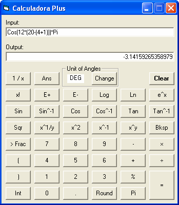



## Calculadora Plus

### Description

This is a scientific calculator that can perform many calculations that can calculate like a Texas Instruments calculator. It can perform powers, square roots, logarithms, and trigonometry; simply add, subtract, multiply, and divide; and do other little things. You can also convert an expression to a fraction and round an expression to specified decimal places. You can switch between three modes of angle units: degrees, radians, and gradians. Using your keyboard, you can enter expressions by typing them into the input box, or by moving and clicking your mouse, you can just simply use the buttons below. I guess if an expression entered is way too complex, the calculator will return an error, otherwise it should work fine. Enjoy the power of this advanced calculator!
 
### More Info
 

             |
---                |---
**Submitted On**   |2006-03-11 13:21:14
**By**             |[mathXpert](https://github.com/Planet-Source-Code/PSCIndex/blob/master/ByAuthor/mathxpert.md)
**Level**          |Intermediate
**User Rating**    |4.8 (29 globes from 6 users)
**Compatibility**  |VB 6\.0
**Category**       |[Math/ Dates](https://github.com/Planet-Source-Code/PSCIndex/blob/master/ByCategory/math-dates__1-37.md)
**World**          |[Visual Basic](https://github.com/Planet-Source-Code/PSCIndex/blob/master/ByWorld/visual-basic.md)
**Archive File**   |[Calculador1979393112006\.zip](https://github.com/Planet-Source-Code/mathxpert-calculadora-plus__1-62676/archive/master.zip)

